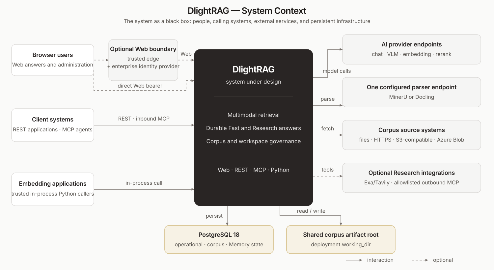
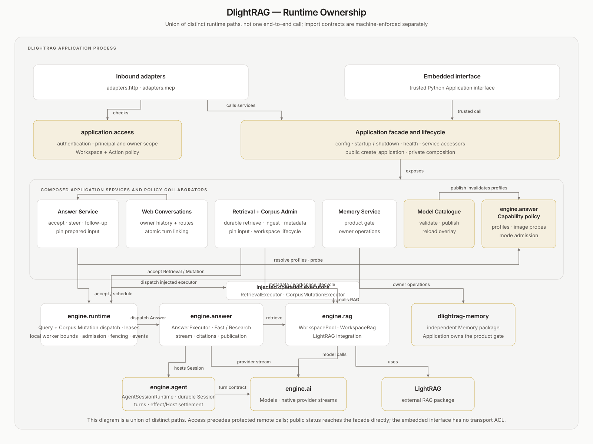
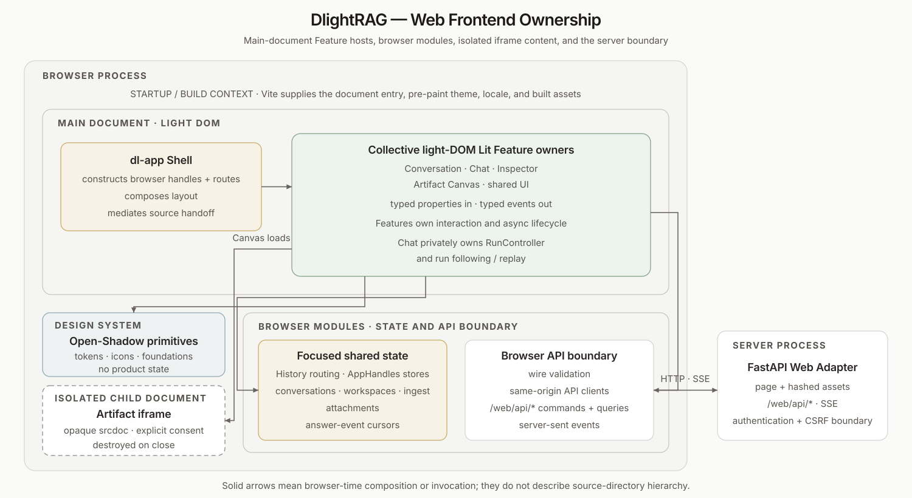
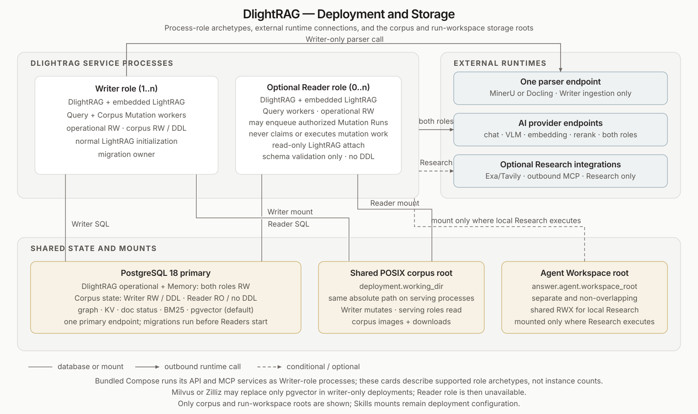

# Architecture

This document owns DlightRAG's major runtime boundaries, the LightRAG/DlightRAG
responsibility split, browser ownership, deployment topology, and code-layering
rules. See [Domain Language](domain-language.md) for canonical terms,
[Interfaces](interfaces.md) for contracts, [Security](security.md) for trust
boundaries, and [Retrieval and Answer](retrieval-answer.md) for query behavior.

## System Context

<p align="center">
  
</p>

Browsers, REST clients, MCP agents, and trusted embedded callers use the same
Application services. External dependencies are PostgreSQL, configured model
providers, one parser sidecar, optional Exa/Tavily Web sources, and optional outbound
MCP endpoints.

Browser identity may terminate at a trusted Cloudflare/Azure/AWS edge or at
DlightRAG's bearer verifier. REST and MCP authenticate on their transports. The
in-process Application is trusted and has no transport authentication layer.
Verified identities flow through one Access policy; owner isolation remains a
separate durable-data boundary.

| View | Question | Arrow meaning |
|---|---|---|
| [System context](#system-context) | What surrounds DlightRAG? | System interaction |
| [Runtime ownership](#runtime-ownership) | Which process owner provides behavior? | Runtime dependency |
| [Web frontend](#web-frontend-ownership) | Which browser owner composes UI? | Browser invocation |
| [Deployment](#deployment-and-storage) | Where do processes and state live? | Runtime/storage connection |

## Runtime Ownership

<p align="center">
  
</p>

`create_application` enters the private composition root. `Application` owns
configuration, lifecycle, health, and service accessors. HTTP and MCP lifespans
bind one started instance; importing a transport or tool module never composes a
fallback service. Adapters invoke transport-neutral Access policy, then
Application services. Embedded callers invoke the facade directly.

Application Configuration has one non-secret YAML owner. Credentials arrive
from a secret source; Deployment Bindings adapt service discovery, listeners,
and mounts without restating product policy. The deployment contract lives in
[Configuration](configuration.md#configuration-ownership) and
[ADR 0006](adr/0006-configuration-ownership-and-deployment-bindings.md).

Answer Service, Retrieval Service, and Corpus Mutation Service validate and
accept top-level work through Engine Runtime. One `RunRuntime` owns shared
lifecycle, fencing, events, capacity, and dispatch across the Query and Corpus
Mutation lanes. Engine Answer uses Agent, RAG, Runtime, and provider-neutral AI;
Retrieval and Corpus Mutation executors use Engine RAG. Answer-internal
retrieval calls the same raw Retrieval Stage directly rather than creating a
nested Run. Memory is an independent package exposed through an Application
capability. Concrete PostgreSQL adapters are injected by the composition root
and remain outside Engine.

### LightRAG Versus DlightRAG

| LightRAG owns | DlightRAG adds |
|---|---|
| Parser routing and staged ingest | Source staging and metadata governance |
| Document chunks and status | Durable Corpus Mutation, Retrieval, and Answer Runs |
| Vector store and knowledge graph | PostgreSQL BM25 and RRF fusion |
| `mix` retrieval | Filtered/federated retrieval and direct visual alignment |
| Multimodal chunk analysis | Answer orchestration, resources, citations, and artifacts |
| Core RAG data model | REST, MCP, Web, and Application interfaces |

DlightRAG does not reimplement parser sidecars, document status, KG extraction,
or LightRAG `mix` retrieval.

## Core Flows

### Ingestion

```text
source
  -> DlightRAG staging + metadata normalization; publish readiness=false
  -> LightRAG parser routing (MinerU or Docling wildcard; native fallback)
  -> LightRAG staged ingest (chunks, KG, vectors, document status)
  -> required DlightRAG maintenance (fused visual vector, BM25 language, metadata/source)
  -> publish readiness=true
```

Both parser adapters converge on LightRAG's shared intermediate representation.
Tables and equations remain structured text. Successful visual chunks keep one
LightRAG chunk identity: when the embedding provider supports fused text+image
input, DlightRAG replaces that chunk's vector with one fused vector combining
its VLM description and image. Text-only configurations retain LightRAG's
semantic text vector. When visual fusion is enabled and applicable, its failure
fails finalization rather than publishing a partially prepared document.

Parser policy applies only to durable workspace ingestion. Answer attachments
never invoke MinerU or Docling.

### Retrieval And Answer

```text
query
  -> planning and optional metadata filter inference
  -> finalized-only LightRAG chunks + direct visual retrieval + PostgreSQL BM25
  -> RRF fusion, provenance hydration, and final rerank
  -> answer packing with citations and bounded images
```

Product Document visibility is always-on and orthogonal to caller metadata
filters. Every directly attributable document/chunk surface requires a metadata
row whose `_dlightrag_finalization_complete` marker is exactly true. Shared
LightRAG entity/relationship summaries remain eventually consistent and are not
presented as per-document MVCC snapshots.

A top-level `/retrieve` request is accepted as a durable owner-scoped Run and
returns the broader knowledge-base result through the common Run status/event
interfaces. `/answer` first resolves `auto | fast | research`, then calls the
same raw retrieval capability as an internal stage when needed; it does not
create a nested Retrieval Run:

- **Fast** reserves one Host turn on the canonical Agent Session, plans,
  retrieves, and generates without an Agent Operation, tools, workspace, or
  publication.
- **Research** drives product-neutral `AgentSessionRuntime` on one Lane with a
  closed run-local tool registry. Tools may read attachments, search the corpus
  or Web, use rooted files/Bash when enabled, call allowlisted MCP endpoints,
  use Profile Memory, load Skills, and run bounded child Sessions.

The last Research assistant turn with no tool call is the answer. Citation,
source, media, usage, and Artifact finalization is deterministic for both paths;
there is no hidden finalizer model call.

Research provider text is an optimistic projection. Native provider deltas flow
through `emit_token`; `reset` invalidates them before a tool-bearing turn,
provider retry/failure, correction/follow-up, recovery, or canonical rewrite.
The complete Assistant Turn and tool plan settle through the Agent Session, and
the canonical result remains terminal authority.

Artifact publication follows a separate structured authority path:

```text
parent Research attach_artifact
  -> ToolResult + ArtifactAttachment Host update (one Effect Settlement)
  -> PostgreSQL Root Artifact Attachment authority
  -> fenced terminal raw-digest and safe-dependency validation
  -> Published Artifacts + canonical result
```

`artifact:` links control placement and dependencies but never authorize a
workspace file. Fast and Child Sessions cannot attach roots. See
[ADR 0004](adr/0004-structured-artifact-attachment-authority.md).

`RetrievalPlanner` is internal to retrieval. It may derive lexical terms,
metadata filters, and image context but never receives attachment bytes or
rewrites an agent-selected semantic query. Workspace authorization resolves at
the interface Access boundary before Engine RAG runs.

Detailed filtering, reranking, multimodal, and packing behavior lives in
[Retrieval and Answer](retrieval-answer.md).

### Answer Resources

```text
query + attachments
  -> run-scoped ResourceRegistry
  -> deterministic read or focused VLM inspect
  -> bounded text/image evidence
  -> Fast or Research context
```

Full resource bytes never enter model context. `read` handles UTF-8/CSV directly
and converts HTML, PDF, DOCX, PPTX, and XLSX through selected offline
converters; OOXML passes a zip-bomb preflight. `inspect` performs focused VLM
inspection and records exact source/page/sheet/cell provenance. Current images
may also feed retrieval and final generation within separate budgets.

Resources are scoped to one Answer Run. Accepted uploads and settled Web
fetches use owner-scoped content-addressed blobs so recovery does not re-fetch
or cross owner boundaries. They never become corpus documents, chunks, vectors,
BM25 rows, or KG data.

Agent execution is `disabled`, `trust`, or `sandbox`. `trust` exposes rooted
file tools but Bash retains host/network capability. This distribution has no
sandbox backend, so `sandbox` fails instead of downgrading. Skills are discovered
from the configured global root (default `~/.dlightrag/skills`) and the viewer's
own published skills under the per-owner root (default
`~/.dlightrag/owner_skills`), and loaded progressively. Owner skills shadow
global names for that owner only. Research parent runs additionally hold
`publish_skill` and `delete_skill`, the validated owner publication channel.
Outbound MCP tools come only from deployment allowlists.

## Durable Execution

One operation-neutral `RunRuntime` owns durable lifecycle. Retrieval and Answer
executors share its Query Lane. Ingest, replace, exact delete, retry, and reset
executors share its Corpus Mutation Lane with independent per-process worker
bounds and a deployment-wide nonterminal admission limit. Top-level work across
REST, MCP, Web, Application, CLI,
and evaluation is a PostgreSQL-owned Run:

```text
accept  -> Run + bounded immutable prepared input
claim   -> oldest lane-eligible row; lease + fencing epoch
execute -> operation-owned phases/checkpoints and durable events
finish  -> canonical result + exactly one terminal event (one transaction)
recover -> reclaim expired lease and execute from durable authority
```

Retrieval pins model identities/profiles, model-catalogue and context-policy
revisions, the authorized Workspace set, and the normalized request needed to
repeat planning and search after a crash. Its
terminal stored result is transport-neutral; reader projections apply current
source-download and visual permissions, with MCP download URLs remaining null.
Corpus unavailability checkpoints and defers the same Run with bounded backoff,
while the configured retrieval execution timeout is terminal.

Answer additionally accepts routing, Session state, and blobs atomically. A
disconnected client only detaches. Research restores immutable Session entries,
typed registers, exact request/effect state, and selected Lane. Fast restores
staged answer phases and can terminalize an already staged result without
regeneration. Provider deltas are observational; persisted Request Snapshots,
Assistant Turns, ToolResult/Host-update settlements, and canonical results are
recovery authority. Recovery resets any invalid optimistic draft before
replacement output.

Corpus Mutation acceptance persists bounded Prepared Input and a stable upstream
`track_id`. Durable execution is FIFO within a Workspace and concurrent across
Workspaces. This database-enforced mutation ordering is distinct from the
process-local `AccessScheduler`, which provides conflict-based mutual exclusion
for Agent tools without a FIFO waiter guarantee. Before a destructive or otherwise non-idempotent LightRAG effect,
the executor durably records handoff. Recovery then reconciles authoritative
public LightRAG state; an ambiguous outcome enters `waiting_for_repair`, and an
authorized operator resumes that same Run after repair. A reset may explicitly
supersede one waiting Run while retaining Workspace identity and history.

Engine Runtime owns storage-neutral lifecycle records, its store and blob ports,
subscriptions, fencing, and coordination. Retrieval, Answer, and Corpus
Mutation executors map product outcomes into Runtime settlements. `PGRunStore` implements operational
state and `PGRunBlobStore` implements immutable PostgreSQL `BYTEA` bytes. Full
lifecycle, recovery, cancellation, event, blob, and conversation rules are
centralized in [RunRuntime and durable execution](durable-answer-runs.md).

## Web Frontend Ownership

<p align="center">
  
</p>

Vite owns the static entry, pre-paint theme, and built assets. Light-DOM Lit
Features own typed presentation and interaction. FastAPI serves page/static
assets plus same-origin `/web/api/*` commands, queries, and SSE. There is no
Jinja or HTMX UI path. Light DOM is composition (the document is the Feature
interface). Open Shadow DOM is reserved for design-system primitives with no
domain state. See [ADR 0003](adr/0003-light-composition-shadow-primitives.md).

State is divided by lifetime: the History API owns active conversation routing;
focused stores own conversations, workspaces, attachments, ingest, and answer
runs. The Shell constructs those stores once and passes an `AppHandles` bag.
Feature components receive properties and raise typed events. The Shell may
query sibling Feature custom elements, not their internals, and does not use
module-global notification channels.

The package design system owns tokens, icons, Shadow primitives, and split
layout. The Shell mediates Artifact-to-Inspector source opening: on desktop,
Side stays Side, Wide stays Wide, and Fullscreen reduces to Wide; on compact
layouts the Canvas closes and Sources opens in the Inspector drawer. Sanitized
answer/source HTML is the only same-DOM HTML sink and is never typeset inside a
shadow root. Active HTML Artifacts require explicit consent and render in a
destroyed-on-close, opaque-origin iframe. Security details live in
[Security](security.md#answer-artifact-browser-boundary).

A custom element is a Feature only when it independently owns at least two of
state, lifecycle, user intent, async work, accessibility, or reusable structure.
Otherwise keep a function or a private template. Binding decisions:
[ADR 0001](adr/0001-application-engine-adapters-architecture.md) (process zones),
[ADR 0002](adr/0002-browser-wire-validation.md) (browser wire), and
[ADR 0003](adr/0003-light-composition-shadow-primitives.md) (Light vs Shadow).
Publication authority is recorded separately in
[ADR 0004](adr/0004-structured-artifact-attachment-authority.md).

### Web Conversation Boundary

A Web conversation owns navigation/history, not execution. Each turn links to
the Answer run that owns input, blobs, events, and result. The turn and run are
inserted in the same acceptance transaction.

Attachments are stored once as owner-scoped blobs and linked by run references.
Follow-ups re-register them lazily, newest first within the count limit. There
is no Web attachment cache, parsed-chunk table, or vector cache. Run retention
and conversation deletion release blobs only after no surviving run references
them. See [Interfaces](interfaces.md#web) for browser contracts.

## Deployment And Storage

<p align="center">
  
</p>

All service processes use the same PostgreSQL 18 primary. The default `writer`
owns migrations, corpus mutations, and every interface. A `reader` is
**corpus-read-only**, not process-read-only: it may write operational state for
answers, events, Root Artifact Attachments, Published Artifacts, and Web
conversations while rejecting ingestion, workspace changes, metadata mutation,
retry, and file deletion.

| Component | Backend |
|---|---|
| Vectors | `PGVectorStorage` + pgvector (default), or explicit LightRAG `MilvusVectorDBStorage`; Zilliz uses the Milvus adapter |
| Graph | `PGTableGraphStorage` (fixed) |
| KV | `PGKVStorage` (fixed) |
| Document status | `PGDocStatusStorage` (fixed) |
| Lexical retrieval | pg_textsearch BM25 |
| Product/runtime state | DlightRAG PostgreSQL tables |

Every process that serves corpus images/downloads must mount one shared POSIX
`deployment.working_dir` at the same absolute path. Every process executing
trusted/sandboxed Research must also mount one shared RWX
`answer.agent.workspace_root`; it must not overlap the corpus working directory.
Writer migrations must run before readers start. Readers currently require the
default PostgreSQL vector leg because the supported LightRAG version has no
public nonmutating external-vector reader attach. Milvus changes only vector
storage: PostgreSQL text chunks remain the BM25/chunk metadata source, and
Milvus retrieval uses bounded metadata post-filtering rather than PostgreSQL
vector pushdown. See [PostgreSQL](postgresql.md) for deployment details.

## Code Layering

The UV workspace contains the root DlightRAG wheel and the independently
installable `dlightrag-memory` distribution.

```text
inbound adapters -> Application use cases -> Engine execution
        |                                        |
        +-> transport-neutral Engine contracts   +-> AI
private composition root wires concrete Adapters +-> Agent -> AI
                                                 +-> RAG -> AI + LightRAG APIs
                                                 +-> Runtime
                                                 +-> Answer -> AI + Agent + RAG + Runtime

concrete PostgreSQL/observability adapters implement owner ports
```

Only public `create_application` delegates to private composition. Application
does not import concrete adapters. Inbound transports call Application services
and may consume transport-neutral Engine Answer contracts, but no Engine source
module imports Application or inbound transports. RAG owns the direct LightRAG dependency and never imports concrete
PostgreSQL code. Runtime imports neither Answer/RAG nor storage/transports.

`dlightrag-memory` owns its PostgreSQL schema, migrations, retrieval, operation
journal, and stdio MCP server. It imports no root, AI, Agent, or RAG module.
DlightRAG supplies owner identity, eligibility, rendering, and the hard
capability gate; Memory records are low-authority, non-citable context.

`DlightragConfig` mirrors ownership through nine frozen sections. AI owns model
settings, RAG owns corpus settings, and root modules own product-only settings.
Removed aliases and flat schemas are rejected rather than emulated.

Import contracts enforce these directions in source and built wheels:

```bash
uv run lint-imports
```
